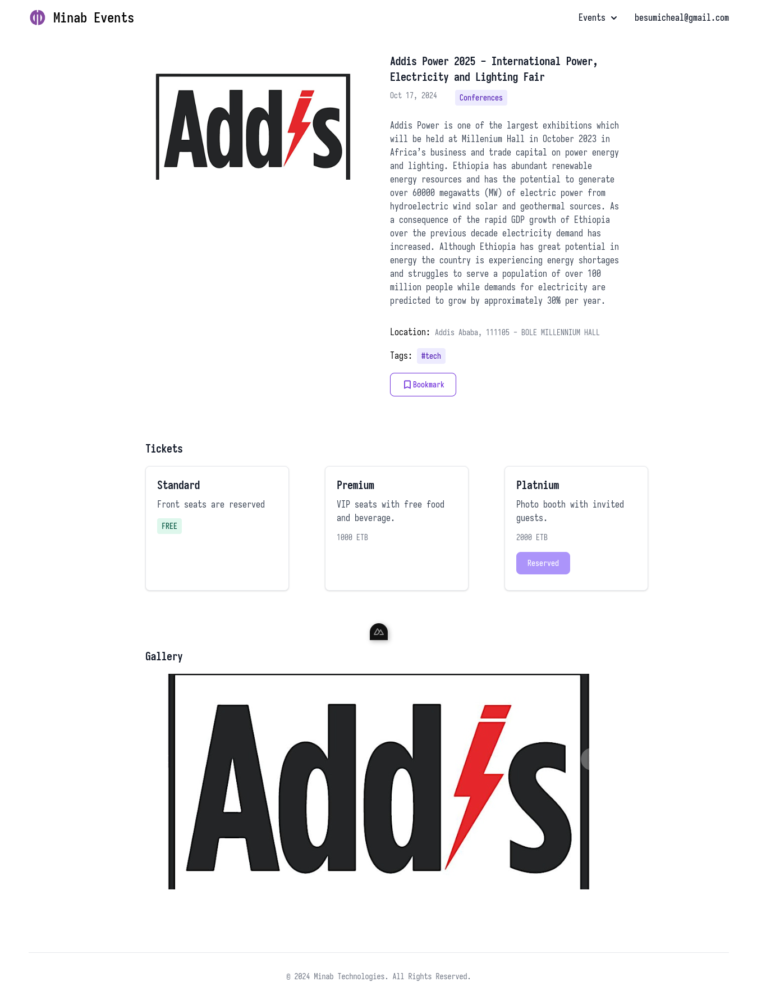
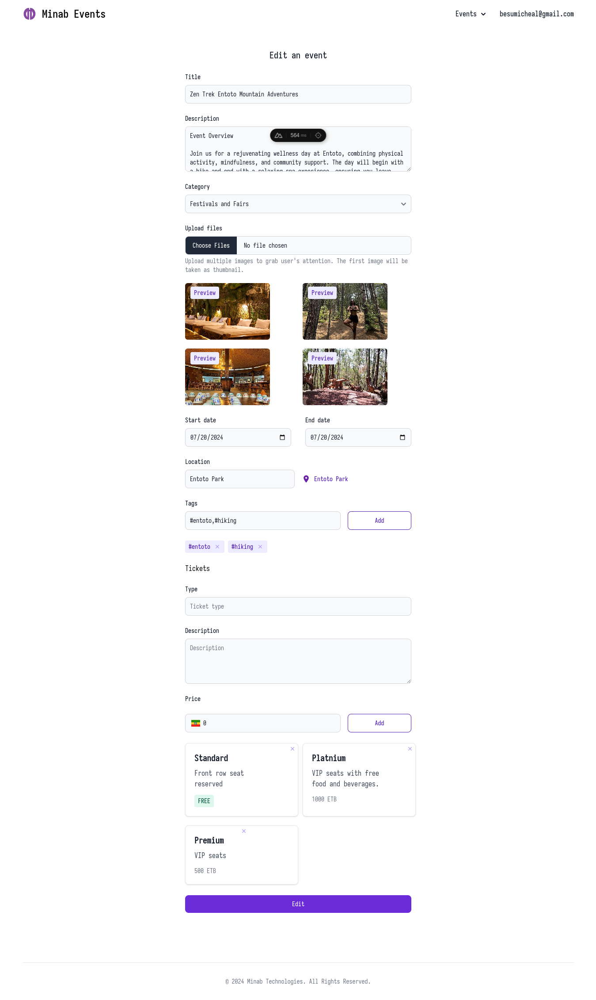

# Minab Events

- Simple event management system.

## Technologies used

- [NuxtJs](https://nuxt.com/) - Frontend framework
- [Flowbite](https://flowbite.com/) - UI library powered by tailwindcss
- [vue-validate](https://vee-validate.logaretm.com/v3/) - Form validation
- [@nuxtjs/leaflet](https://leaflet.nuxtjs.org/) - Map integration
- [@nuxtjs/apollo](https://apollo.nuxtjs.org/) - Apollo client

## Setup

- To setup the backend follow the steps listed in [this](https://github.com/Besufikad17/minab_events_server) repo setup section.

1. Clonning the repo
   
   ```bash
    git clone https://github.com/Besufikad17/minab_events.git
   ```

2. Installing npm packages
   
   ```bash
    cd minab_events && npm install
    ```
3. Connecting to backend
      
   ```bash
   touch .env
   ```
   ```.env
   GQL_HOST=""
   PLACE_API_URL=""
   PLACE_API_KEY=""
   ```
4. Running
    ```bash 
    npm run dev
    ```

## Preview

**Auth pages**


**Landing page**


**Browse events page**


**Event details**





**Bookmarks and Reserved events page**


**Create and Edit event page**


